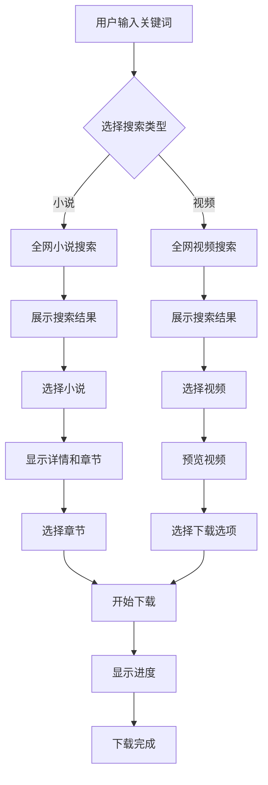

# Scrapling 下载器 - 产品需求文档

## 1. 产品概述

Scrapling 下载器是一款基于 Scrapling 框架的智能内容下载工具，支持小说和视频的全网搜索与下载。通过集成先进的反检测技术，用户可以轻松获取各类数字内容。

- **主要目的**：提供一站式的小说和视频下载解决方案，解决传统下载器易被检测、功能单一的问题
- **目标用户**：内容爱好者、研究人员、数据分析师等需要批量下载网络内容的用户

## 2. 核心功能

### 2.1 功能模块

1. **首页**：搜索入口、热门推荐、下载任务列表
2. **小说下载页**：小说搜索、详情预览、章节选择、下载管理
3. **视频下载页**：视频搜索、预览、格式选择、下载队列

### 2.2 页面详情

| 页面名称 | 模块名称 | 功能描述 |
|---------|---------|---------|
| 首页 | 搜索栏 | 全局搜索框，支持小说/视频关键词搜索，自动补全建议 |
| 首页 | 快捷入口 | 小说下载、视频下载两大功能入口卡片 |
| 首页 | 下载任务 | 实时显示当前下载任务进度，支持暂停/继续/取消 |
| 首页 | 热门推荐 | 展示热门小说和视频内容 |
| 小说下载页 | 搜索结果 | 显示搜索到的小说列表，包含封面、标题、作者、简介 |
| 小说下载页 | 详情面板 | 显示小说详细信息、章节目录、下载选项 |
| 小说下载页 | 章节选择 | 支持全选、范围选择、单选章节 |
| 小说下载页 | 下载控制 | 开始下载、暂停、导出格式选择（TXT/EPUB/PDF） |
| 视频下载页 | 搜索结果 | 显示搜索到的视频列表，包含缩略图、标题、时长、来源 |
| 视频下载页 | 预览播放 | 内置播放器预览视频内容 |
| 视频下载页 | 下载选项 | 选择分辨率、格式（MP4/WEBM/AUDIO）、下载路径 |

## 3. 核心流程

### 3.1 小说下载流程

用户输入关键词 → 系统全网搜索 → 展示搜索结果列表 → 用户选择小说 → 显示详情和章节 → 用户选择章节 → 开始下载 → 显示进度 → 下载完成导出

### 3.2 视频下载流程

用户输入关键词 → 系统全网搜索 → 展示搜索结果列表 → 用户选择视频 → 预览视频 → 选择下载选项 → 开始下载 → 显示进度 → 下载完成

## 4. 用户界面设计

### 4.1 设计风格

- **主色调**：深色系背景（#0F0F1A）配合霓虹蓝（#00D4FF）和霓虹紫（#7B2DFF）作为强调色
- **按钮风格**：圆角设计（rounded-xl），带有微妙发光效果，悬停时亮度增强
- **字体**：标题使用 "Orbitron" 科技感字体，正文使用 "Inter" 清晰易读
- **布局风格**：卡片式布局，顶部导航，侧边快捷操作栏
- **图标风格**：线性图标（lucide-react），配合渐变色效果

### 4.2 页面设计概览

| 页面名称 | 模块名称 | UI 元素 |
|---------|---------|---------|
| 首页 | 搜索栏 | 居中大搜索框，玻璃态背景，霓虹边框动画 |
| 首页 | 快捷入口 | 两个大型卡片，渐变背景，悬停时放大动画 |
| 首页 | 下载任务 | 列表卡片，进度条带动画，操作按钮 |
| 小说下载页 | 搜索结果 | 网格卡片布局，封面图片，悬停显示详情 |
| 小说下载页 | 详情面板 | 右侧抽屉式面板，章节树形列表 |
| 视频下载页 | 搜索结果 | 横向卡片布局，缩略图，悬停播放预览 |
| 视频下载页 | 预览播放 | 模态框播放器，支持全屏 |

### 4.3 响应式设计

- 桌面优先设计，适配 1920x1080 及以上分辨率
- 平板适配：调整卡片网格为 2 列
- 移动端适配：单列布局，底部导航栏

### 4.4 动画效果

- 页面加载：渐入动画，卡片依次出现
- 悬停效果：卡片上浮，边框发光
- 下载进度：脉冲动画，数字动态更新
- 搜索结果：瀑布流加载动画

## 5. 技术要求

### 5.1 性能要求

- 搜索响应时间 < 3 秒
- 支持同时下载 5 个任务
- 大文件下载支持断点续传

### 5.2 兼容性

- 支持 Windows 10/11
- 支持 Chrome/Edge/Firefox 浏览器
- 后端服务支持本地运行

## 6. 后端集成

### 6.1 Scrapling 集成

- 使用 `StealthyFetcher` 处理反爬检测
- 使用 `DynamicFetcher` 处理动态页面
- 使用自适应选择器应对网站改版

### 6.2 下载功能

- 小说：支持 TXT/EPUB/PDF 导出
- 视频：支持多分辨率下载，支持仅下载音频