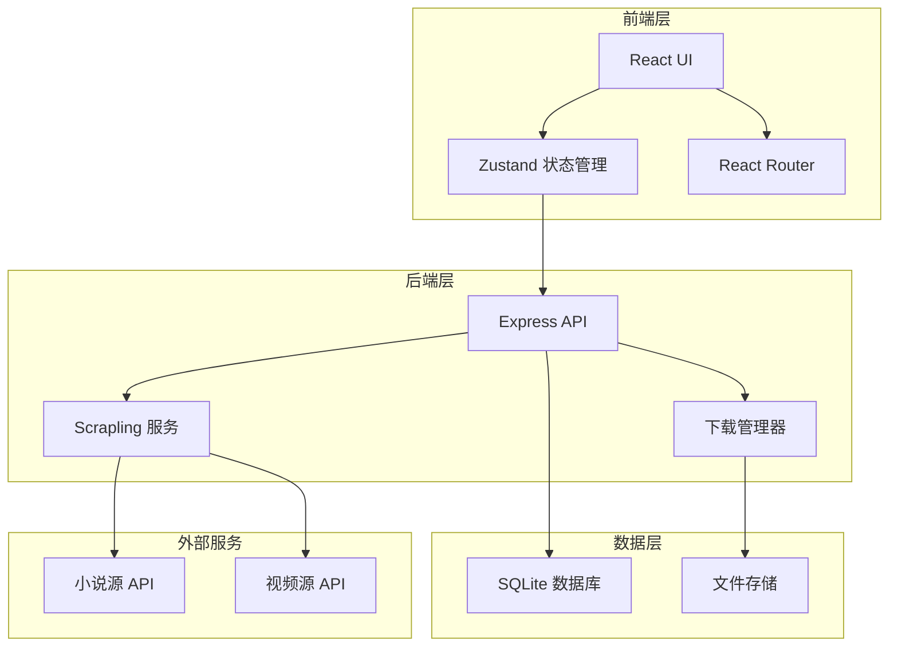
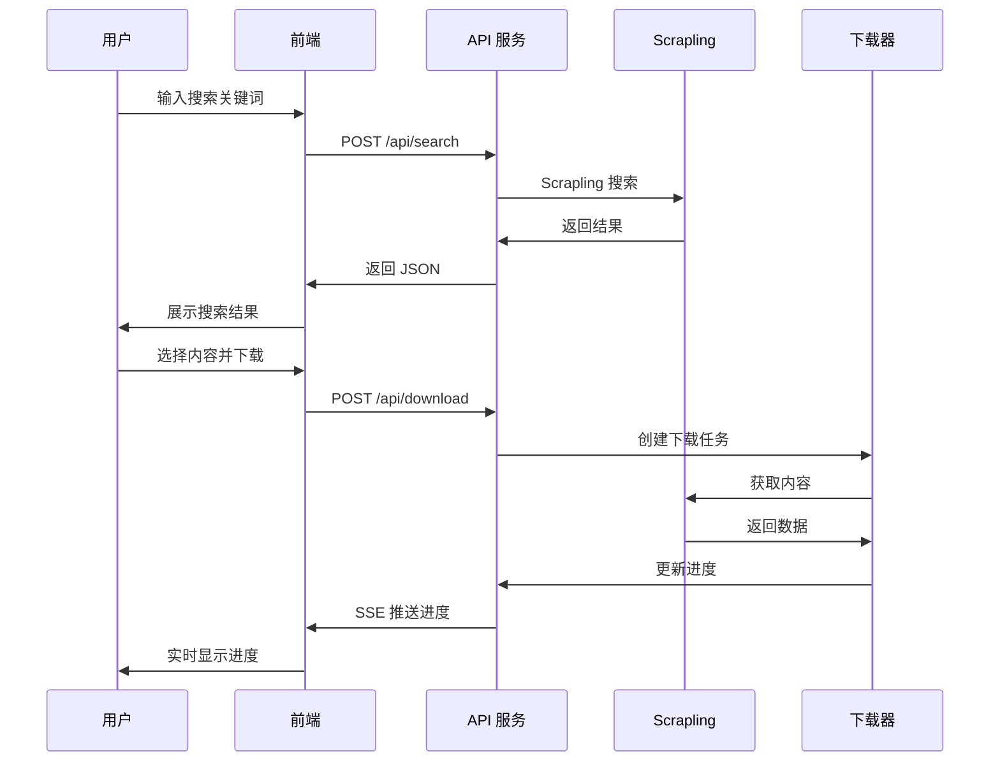
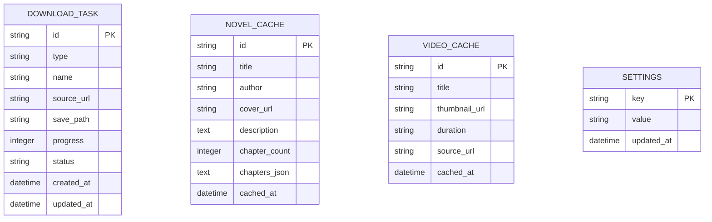

# Scrapling 下载器 - 技术架构文档

## 1. 架构设计



## 2. 技术描述

### 2.1 前端技术栈

- **框架**：React 18 + TypeScript
- **构建工具**：Vite
- **样式**：Tailwind CSS
- **状态管理**：Zustand
- **路由**：React Router DOM
- **图标**：Lucide React
- **动画**：Framer Motion

### 2.2 后端技术栈

- **框架**：Express.js + TypeScript
- **爬虫引擎**：Scrapling (StealthyFetcher, DynamicFetcher)
- **数据库**：SQLite (better-sqlite3)
- **文件处理**：archiver (ZIP), epub-gen (EPUB)

### 2.3 一键启动

- **启动脚本**：Windows Batch (.bat)
- **服务管理**：concurrently 并发运行前后端
- **自动打开**：浏览器自动打开 Web UI

## 3. 路由定义

| 路由 | 用途 |
|------|------|
| `/` | 首页 - 搜索入口和任务列表 |
| `/novel` | 小说下载页 - 搜索和下载小说 |
| `/video` | 视频下载页 - 搜索和下载视频 |
| `/settings` | 设置页 - 下载路径、并发数等配置 |

## 4. API 定义

### 4.1 搜索 API

```typescript
// POST /api/search
interface SearchRequest {
  keyword: string;
  type: 'novel' | 'video';
  page?: number;
}

interface SearchResponse {
  success: boolean;
  data: NovelSearchResult[] | VideoSearchResult[];
  total: number;
  page: number;
}

interface NovelSearchResult {
  id: string;
  title: string;
  author: string;
  cover: string;
  description: string;
  chapters: number;
  source: string;
}

interface VideoSearchResult {
  id: string;
  title: string;
  thumbnail: string;
  duration: string;
  source: string;
  url: string;
}
```

### 4.2 下载 API

```typescript
// POST /api/download/novel
interface NovelDownloadRequest {
  novelId: string;
  chapters: number[]; // 章节索引列表
  format: 'txt' | 'epub' | 'pdf';
}

// POST /api/download/video
interface VideoDownloadRequest {
  videoUrl: string;
  quality: '1080p' | '720p' | '480p' | 'audio';
  format: 'mp4' | 'webm' | 'mp3';
}

// GET /api/download/tasks
interface DownloadTask {
  id: string;
  type: 'novel' | 'video';
  name: string;
  progress: number;
  status: 'pending' | 'downloading' | 'completed' | 'error';
  speed?: string;
  size?: string;
}
```

### 4.3 任务管理 API

```typescript
// POST /api/tasks/:id/pause
// POST /api/tasks/:id/resume
// DELETE /api/tasks/:id
// GET /api/tasks
```

## 5. 服务架构图



## 6. 数据模型

### 6.1 实体关系图



### 6.2 数据库初始化

```sql
CREATE TABLE IF NOT EXISTS download_tasks (
    id TEXT PRIMARY KEY,
    type TEXT NOT NULL,
    name TEXT NOT NULL,
    source_url TEXT,
    save_path TEXT,
    progress INTEGER DEFAULT 0,
    status TEXT DEFAULT 'pending',
    created_at DATETIME DEFAULT CURRENT_TIMESTAMP,
    updated_at DATETIME DEFAULT CURRENT_TIMESTAMP
);

CREATE TABLE IF NOT EXISTS novel_cache (
    id TEXT PRIMARY KEY,
    title TEXT NOT NULL,
    author TEXT,
    cover_url TEXT,
    description TEXT,
    chapter_count INTEGER,
    chapters_json TEXT,
    cached_at DATETIME DEFAULT CURRENT_TIMESTAMP
);

CREATE TABLE IF NOT EXISTS video_cache (
    id TEXT PRIMARY KEY,
    title TEXT NOT NULL,
    thumbnail_url TEXT,
    duration TEXT,
    source_url TEXT,
    cached_at DATETIME DEFAULT CURRENT_TIMESTAMP
);

CREATE TABLE IF NOT EXISTS settings (
    key TEXT PRIMARY KEY,
    value TEXT,
    updated_at DATETIME DEFAULT CURRENT_TIMESTAMP
);

-- 初始化默认设置
INSERT OR IGNORE INTO settings (key, value) VALUES 
    ('download_path', './downloads'),
    ('max_concurrent', '3'),
    ('novel_format', 'txt'),
    ('video_quality', '1080p');
```

## 7. 项目结构

```
scrapling-downloader/
├── src/                    # 前端源码
│   ├── components/         # 可复用组件
│   ├── pages/              # 页面组件
│   ├── hooks/              # 自定义 Hooks
│   ├── stores/             # Zustand 状态
│   └── utils/              # 工具函数
├── api/                    # 后端源码
│   ├── routes/             # API 路由
│   ├── services/           # 业务逻辑
│   ├── scrapling/          # Scrapling 集成
│   └── db/                 # 数据库操作
├── downloads/              # 下载目录
├── start.bat               # 一键启动脚本
└── package.json
```

## 8. 一键启动脚本

```batch
@echo off
chcp 65001 >nul
title Scrapling 下载器

echo ========================================
echo   Scrapling 下载器 - 启动中...
echo ========================================
echo.

:: 检查 Node.js
where node >nul 2>nul
if %errorlevel% neq 0 (
    echo [错误] 未找到 Node.js，请先安装 Node.js
    pause
    exit /b 1
)

:: 检查依赖
if not exist "node_modules" (
    echo [信息] 正在安装依赖...
    call npm install
)

:: 启动服务
echo [信息] 正在启动服务...
start "" http://localhost:5173
call npm run dev

pause
```